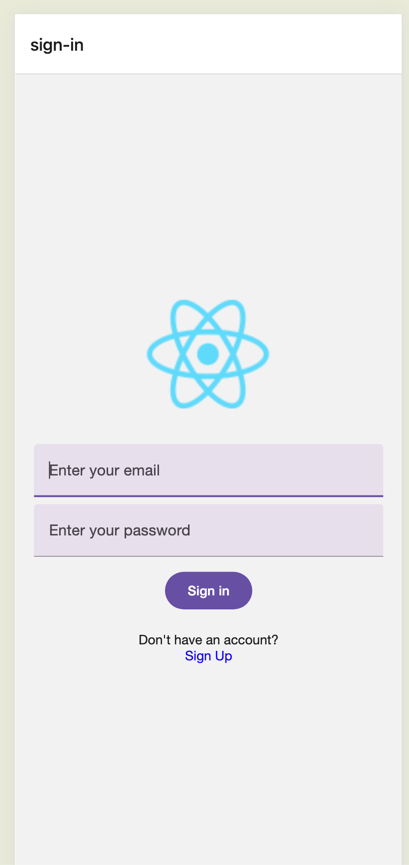
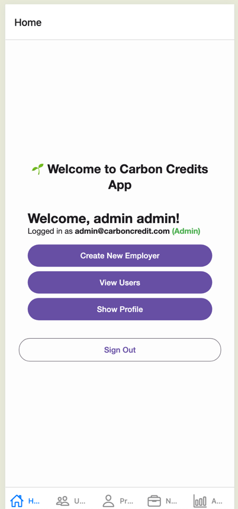
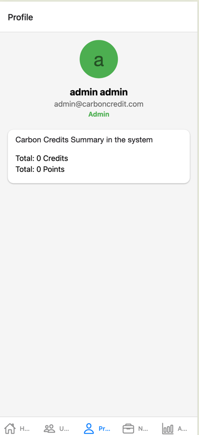
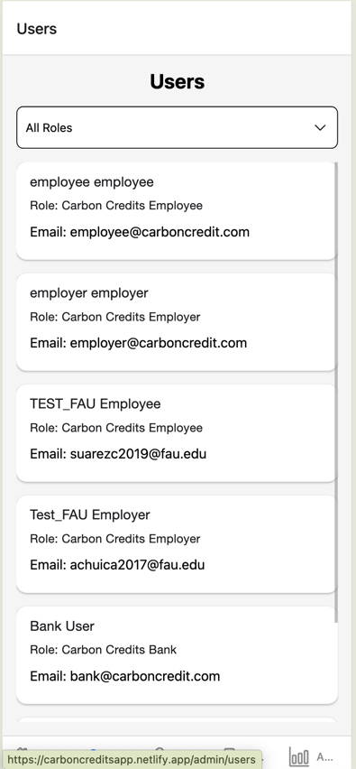

# Carbon Credit Trading and Tracking Platform

## Introduction

The **Carbon Credit Trading and Tracking Platform** is designed to encourage sustainable travel by enabling employees to accumulate carbon credits through eco-friendly travel methods. Employers can buy, sell, and trade these credits, while the system tracks and verifies travel activities to ensure accuracy and prevent fraud. The platform also provides analytics and reporting for both employees and employers.

---

## Features

### General Features
- Employers and employees can register for the platform.
- Employees register under employers, and their accounts require employer approval.
- Employer accounts require verification by a carbon credit banking institution.
- Tracks employees’ daily commute and assigns carbon credits based on the mode of transportation.
- Supports multiple travel modes: public transport, carpooling, working from home, flights, etc.
- Employers can trade carbon credits with other organizations via a marketplace.
- Provides analytics and reporting for employees and employers.
- Implements fraud detection mechanisms to prevent false credit accumulation.
- Ensures security and privacy of user data.

---

## Functional Requirements

### User Authentication & Registration
- Secure registration and login for employers and employees.
- Employees require employer approval before account activation.
- Employers require carbon credit bank approval to start trading.

### Carbon Credit Tracking
- Tracks daily travel via:
  - GPS location tracking (for private transport and ride-sharing).
  - Public transport and Google Maps API integration.
  - Employer verification for manual reports (employees can upload receipts for verification).
- Assigns carbon credits based on miles saved and transportation mode.

### Carbon Credit Trading
- Employers can buy, sell, and trade credits via a marketplace.
- Transactions are validated by the carbon credit bank.
- Tracks and displays credit balances.

### Reporting & Analytics
- Employees can view monthly credit reports and progress tracking.
- Employers can access organization-wide carbon footprint data.

### Role-Based Access Control
- Implements role-based permissions for different user roles.

### Employee Gamification & Rewards System
- Includes gamification elements like badges, leaderboards, and point milestones for employees based on eco-friendly travel habits.

---

## Non-Functional Requirements
- **Scalability**: Supports thousands of users simultaneously.
- **Security**: Encrypts user data and implements role-based access control (RBAC).
- **Performance**: Handles real-time tracking efficiently.
- **Compliance**: Adheres to carbon credit trading regulations.
- **Fraud Prevention**: Uses GPS validation and multi-user verification mechanisms.

---

## User Roles & Responsibilities

### Administrator
- Approve or reject employer applications.
- Manage the carbon credit trading system.
- Ensure system security and fraud detection.
- Monitor system performance and logs.

### Carbon Credit Bank Representative
- Approve employer registrations.
- Validate carbon credit transactions.
- Audit employer credit balances and trading history.

### Employer
- Register and get approved by the carbon credit bank.
- Approve or reject employee accounts.
- Track employee carbon credits.
- Buy, sell, and trade carbon credits.
- View carbon footprint reports.

### Employee
- Register and get approved by an employer.
- Track daily commute (via GPS or manual entry).
- Earn carbon credits based on travel method.
- View credit balance and redemption options.

---

## Conclusion

The **Carbon Credit Trading and Tracking Platform** is designed to promote sustainable travel, reduce carbon footprints, and enable efficient trading of carbon credits. By providing robust tracking, fraud prevention, and analytics, the platform ensures transparency and encourages eco-friendly practices among employees and employers.

---

## Getting Started

### Prerequisites
- Node.js
- React Native
- Expo CLI

### Installation
1. Clone the repository:
   ```bash
   git clone git@github.com:mrh-jishan/CarbonCreditsApp.git
   ```
2. Navigate to the project directory:
   ```bash
   cd CarbonCreditsApp
   ```
3. Install dependencies:
   ```
   npm install
   ```
4. Start the development server:
   ```
   npx expo start
   ```

## Example Pages

- Login Page


- Home Page


- Profile Page


- User Page


## Backend Server

Please visit `git@github.com:mrh-jishan/CarbonCreditsApi.git`